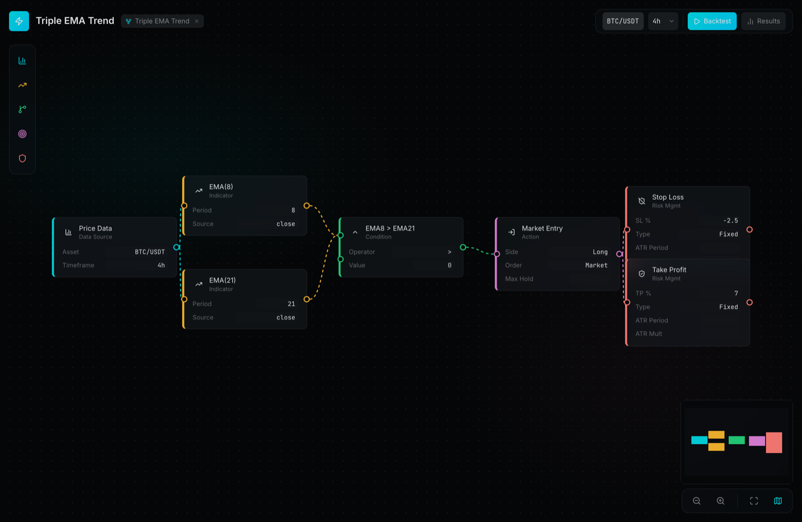
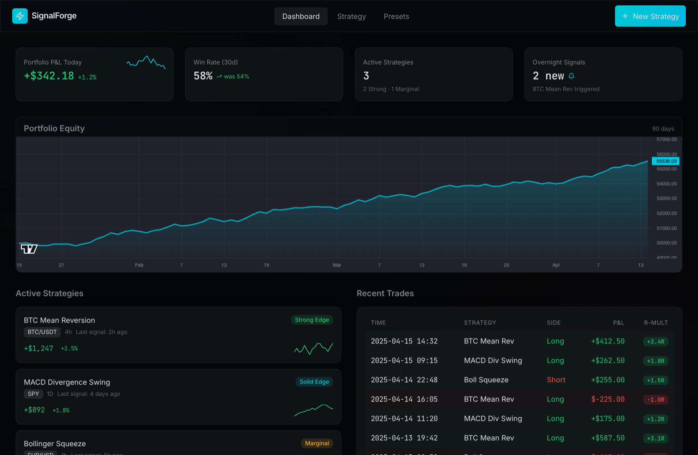
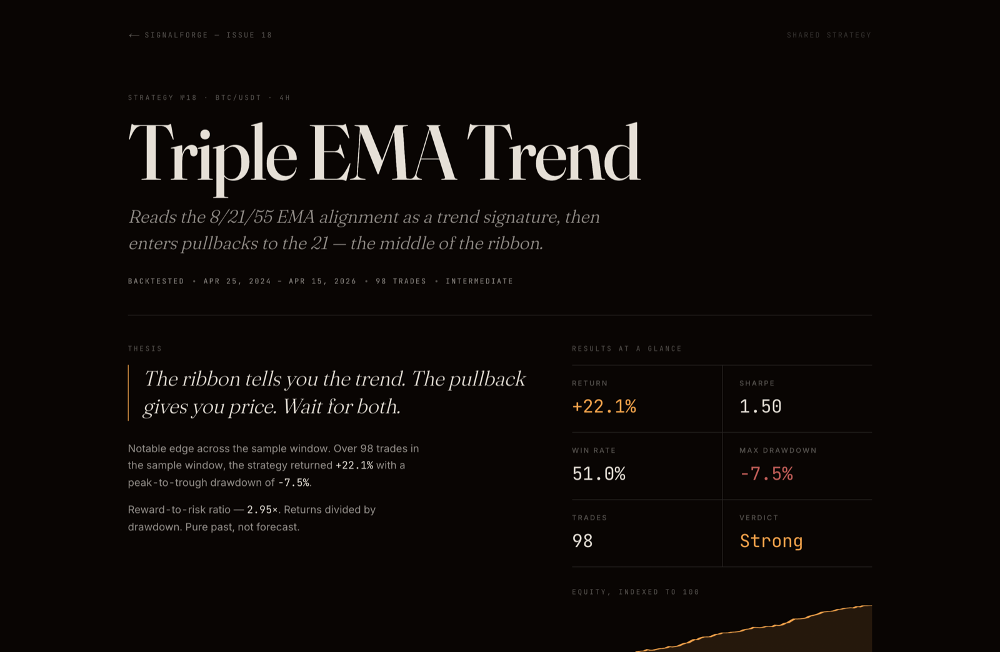

# SignalForge

A visual strategy builder for traders who think in rules, not code.



Testing a trading idea usually means writing a script — most ideas die before
they get that far. SignalForge turns the idea itself into the artifact: wire
indicators, conditions, and risk nodes on a canvas, then backtest the graph
deterministically in the browser.

89 integration tests · 0 `any` across 9,353 lines of strict TypeScript ·
dark-only design system with enforced token discipline.

## What it does

- **Strategy canvas** — strategies are node graphs: price data → indicators →
  conditions → entry → risk management. Multiple indicators of the same type
  coexist (EMA(8) and EMA(21) side by side), and conditions compare indicator
  to indicator, not just indicator to threshold.
- **Backtest engine** — resolves the graph into a bar-by-bar simulation:
  14 indicator functions (EMA, RSI, MACD, Bollinger, ATR, Stochastic, ADX,
  VWAP, Donchian, pivot points, swing highs/lows, …), an indicator registry
  keyed by node ID, trailing stops, and ATR-based stops. Results report win
  rate, Sharpe (only past 10 trades — below that the sample is noise), max
  drawdown, and per-trade R-multiples.
- **Preset library** — ready-made strategies (mean reversion, golden cross,
  squeeze breakouts, EMA ribbons) that fork straight onto the canvas.
- **Share pages** — every strategy gets a read-only, magazine-style page at
  `/s/[id]` for sending around without edit access.

| Dashboard | Share page |
| --- | --- |
|  |  |

## Vision, current milestone, roadmap

**Vision.** Create → edit → test → port. Build a strategy as a node graph, tune
it against immediate backtest feedback, and eventually carry the same graph to
a paper-trade environment or a real trading platform.

**Current milestone — simulated data, by design.** This build ships the full
builder and backtest engine running on deterministic **simulated** OHLCV:
candles are generated per asset (BTC/USDT, ETH/USDT, SPY, AAPL, EUR/USD) from
a seeded PRNG. That is a deliberate choice for this phase — backtests are
reproducible run-to-run, and the 89 integration tests can assert exact trade
counts and P&L while the graph semantics and interface are developed. The
current build does not backtest against historical market data, and nothing in
this repo gives trading advice.

**Roadmap.** Historical market data behind the same OHLCV interface, then
strategy portability: export adapters targeting paper-trade environments first,
live platforms after.

## The Forge design system

The design system is written down in [DESIGN.md](DESIGN.md) and enforced, not
aspirational:

- **OKLCH tokens** — every color is a CSS custom property; components never
  hardcode values. Charts get hex equivalents through one bridge module
  (`lib/chart-colors.ts`) because lightweight-charts cannot parse `oklch()`.
- **Color is earned** — green means profit, red means loss, amber warns, cyan
  is the primary action, magenta marks shorts. Decorative color is banned.
- **No-Line Rule** — zero 1px borders. Hierarchy comes from tonal surface
  shifts of at least 5 OKLCH lightness points.
- **Gradient CTA Rule** — exactly one gradient per screen: the primary action.
- **Numbers are data** — every numeric value renders in JetBrains Mono via a
  shared `MonospaceValue` primitive; prose stays in Inter.

The rules live in shared primitives (`components/ui/`), so feature code cannot
quietly re-derive them wrong.

## Architecture

Client-side only — no backend, no auth, no database. State lives in three
Zustand stores (canvas graph, backtest results, panel UI). The canvas is
@xyflow/react; charts are lightweight-charts v5; panels animate with Framer
Motion on Next.js 16 / React 19 / Tailwind v4.

Node field definitions have a single source (`lib/node-fields.ts`) consumed by
both the on-node controls and the inspector, so the two can't drift.

## Quality gates

Every change must pass, locally and in CI:

1. `pnpm build` — zero TypeScript errors (strict mode, no `any`)
2. `pnpm test` — 89 integration tests across the engine, stores, and preset
   forking
3. `pnpm lint` — zero errors, including React hooks rules
4. Token discipline — no raw Tailwind color utilities anywhere (`bg-white`,
   `text-gray-*`, …); the codebase currently has zero

## Run it

```bash
pnpm install
pnpm dev     # http://localhost:3000
pnpm test    # vitest, 89 tests
pnpm build   # production build
```

Requires Node 22+ and pnpm 11.
