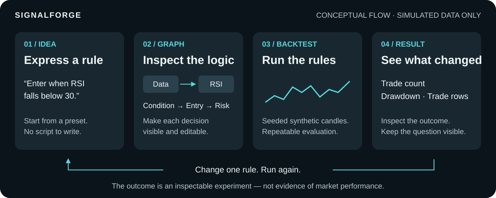
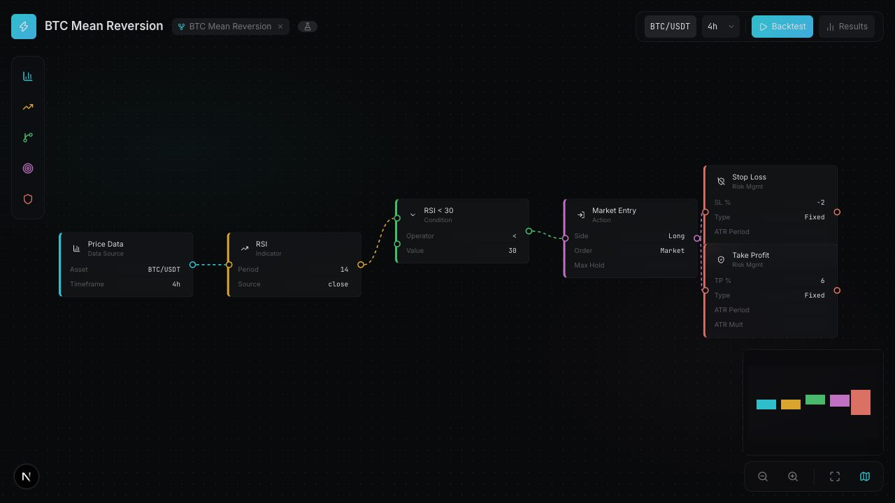
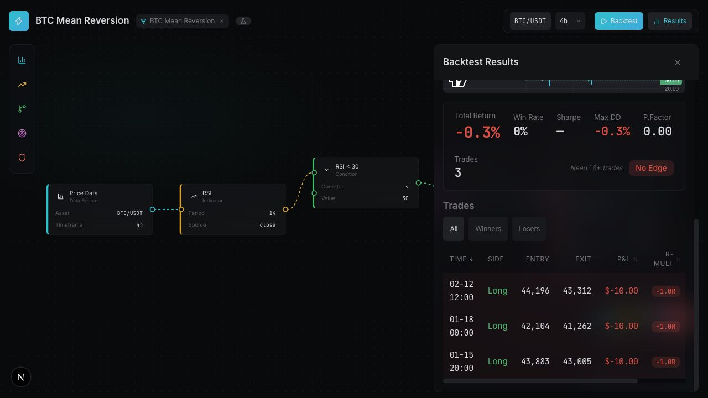

# SignalForge

**Make a trading idea visible. Run the rules. Inspect the result.**

A visual strategy builder and simulation playground, built with Next.js and TypeScript. [MIT licensed](LICENSE).

A trader may know the rule they want to explore, but translating it into code creates a barrier to testing it. SignalForge lets them inspect the rule as a graph, change a parameter, and see the resulting simulated trades in the same workspace.

**The outcome:** an understandable rule and a repeatable experiment. All prices, trades, and returns are **synthetic examples**, not historical market results.



[Try it locally](#try-it-locally) · [Guided walkthrough](docs/walkthrough.md) · [Engineering evidence](docs/engineering.md)

## See the loop

1. **Idea:** “Enter when RSI, a momentum indicator, falls below 30.”
2. **Graph:** open a preset and inspect the connected data, indicator, condition, entry, and risk nodes.
3. **Backtest:** run those rules against seeded, simulated candles in the browser.
4. **Result:** inspect trade count, drawdown, and individual trades; change the threshold and run again.

### 1. Make the rule visible

Each node answers a question: which data, which indicator, when to enter, and how to exit? Start with a preset and inspect the parameters before running it.



### 2. Inspect what the rule produced

The result combines charts, summary statistics, and individual trades. A losing result is still useful feedback about what the rule did in this simulated scenario.



*Actual local-app captures using synthetic data only. Open either image for detail. The [walkthrough](docs/walkthrough.md) follows this same preset.*

## Who this is for

For someone who wants to explore rule-based strategies visually, and for developers interested in graph editors and deterministic simulation. The intended benefit is a shorter path from a rule to an understandable experiment; user time savings have not yet been measured.

## Try it locally

Use **Node.js 22+** and **pnpm 11** (the CI toolchain). No account, API key, database, or `.env` file is needed. Installation and the first build need internet access; Next.js downloads the bundled Google fonts at build time.

```bash
git clone https://github.com/Calvin1921/signal-forge.git
cd signal-forge
pnpm install --frozen-lockfile
pnpm dev
```

Open **[the ready-to-run RSI preset](http://localhost:3000/strategy/btc-mean-rev)** and click **Backtest**. The results panel should show a price chart, RSI chart, summary statistics, and trades. Keep the strategy name, asset, and timeframe unchanged; run again to reproduce the result.

For a first edit, select the **RSI < 30** condition, change its **Value** to **25**, and press **Backtest** again. Read the parameter value: the node title may still say “RSI < 30.” Edits live in memory and are lost on a full page reload.

If port 3000 is busy, run `pnpm dev --port 3001` and open the same route on port 3001. Desktop is the best current canvas experience. See [the walkthrough](docs/walkthrough.md) for controls, expected states, and troubleshooting.

## User value and engineering substance

| What the user gets | What makes it technically interesting |
| --- | --- |
| Rules they can inspect and edit visually | A graph is evaluated into indicator series, conditions, entries, and risk exits. |
| A repeatable feedback loop | Seeded candles and deterministic evaluation make the same inputs reproducible. |
| Multi-indicator rules, such as comparing two moving averages | Indicators are keyed by node ID, so two EMAs keep distinct series. |
| A way to inspect outcomes beyond a headline return | Computed statistics, trade filters, and per-trade details; Sharpe is withheld below 10 trades. |
| A starting point instead of an empty canvas | Ten presets load editable graphs; inline controls and the inspector share field definitions. |

This is a **product-engineering prototype**, with no in-app LLM or agent. Its relevant engineering story is making structured logic inspectable, evaluation reproducible, and results understandable. AI tools assisted development; the runtime evaluates explicit rules.

## Quality signals, with evidence

- **Test discipline:** Vitest covers the generator, engine, statistics, graph connections, and preset loading. [Tests](lib/__tests__/backtest-engine.test.ts) include repeated-input determinism and regression cases.
- **Review gates:** [CI](.github/workflows/ci.yml) runs lint, tests, production build, and explicit typechecking. Dependency auditing is **advisory**, not a blocking security guarantee.
- **Accessibility foundations:** visible focus styles, native form controls, named canvas actions, and labelled diagram previews. Full keyboard graph authoring, screen-reader workflows, mobile panels, and contrast still need a dedicated audit; no WCAG conformance claim.
- **Maintainability:** shared UI primitives, field definitions, and written [design decisions](docs/engineering.md#architecture-and-tradeoffs) make the implementation reviewable.

## Current boundaries

- **Known correctness gaps.** Swing High/Low can read future candles; ATR risk reporting and invalid-graph handling also need correction. The illustrated RSI walkthrough does not use Swing High/Low or ATR stops. Review [known issues](docs/known-issues.md) before extending the engine.
- **Synthetic data only.** No historical feed, brokerage connection, live execution, or evidence of trading profitability. Fees, slippage, and realistic fills are not modeled.
- **Two kinds of demo data.** Canvas backtests compute results from the graph. Dashboard/preset figures and share-page curves are illustrative fixtures, not the result of your latest run.
- **Session-only edits.** No persistence or saved custom share links. `/s/[id]` presents built-in presets, not your edited graph.
- **Determinism includes the name.** The strategy name contributes to the candle seed; renaming changes the data. Keep it fixed when comparing rule changes.
- **Local prototype.** No hosted demo is supplied. Simulation runs on the browser's main thread. A nonce-based security policy supports the app's interactive scripts; deployment still needs validation. See the [engineering guide](docs/engineering.md#limitations-to-review-before-expanding-the-prototype).

## Contribute

Contributions are welcome. Start with the [contributor guide](CONTRIBUTING.md) and [known issues](docs/known-issues.md). Small, reproducible fixes to simulation correctness, accessible controls, and clearer explanations are especially useful. Use synthetic examples in issues, tests, screenshots, and demos.

## Go deeper

[Engineering guide and validation commands](docs/engineering.md) · [Design system](DESIGN.md) · [Audit findings](docs/repo-audit.md)
