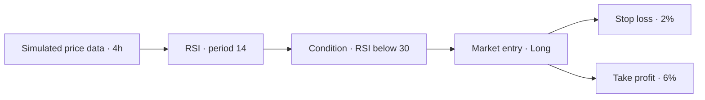

# From an idea to an inspectable result

This walkthrough uses only the built-in synthetic fixture. It requires no financial account, user record, upload, or provider credentials. Asset symbols identify simulated scenarios, not real market feeds.

## 1. Start with a question

“What trades would this rule produce: enter long when RSI(14) is below 30, with a 2% stop and 6% take-profit?” RSI is a momentum indicator; the threshold is an example to test, not a recommendation.

After following the [quick-start](../README.md#try-it-locally), open `/strategy/btc-mean-rev`. Alternatively, visit `/presets` and choose **Use Preset** on **BTC Mean Reversion**. The loaded canvas name is **BTC Mean Reversion**.

## 2. Read the graph

The data node supplies generated candles. The indicator converts them into a momentum measure. The condition gates entry. Risk nodes specify exits. The engine also applies a default maximum hold of 30 bars, a three-bar cooldown, and closes an open position on the last candle.

Use **Fit to view** in the bottom toolbar if nodes are offscreen. Select a node to open its inspector; its fields also appear inline. Keep the default name, asset, timeframe, and indicator period for this demonstration.

## 3. Run the experiment

Press **Backtest** in the top-right toolbar. Expect a brief loading state followed by **Backtest Results**: simulated candles, an RSI chart, statistics, and a trade table. Scroll inside the results panel to reach the table. Use **Results** to reopen the panel if closed.

Read three things before return:

- **Trades:** how many observations support this run?
- **Max DD:** the largest decline in the computed closed-trade equity series; it does not include intratrade unrealized loss.
- **Trade rows:** entry/exit prices, direction, duration, and R-multiple (profit or loss relative to modeled risk).

Sharpe is hidden when there are fewer than 10 trades. A health label is a prototype heuristic, not proof of a profitable strategy. Dashboard and preset-card numbers are separate fixtures; do not expect them to match this run.

*Verified baseline: three trades; Sharpe withheld because there are fewer than ten. These figures illustrate behavior, not market performance.*

## 4. Change one thing

Select **RSI < 30** and change **Value** from **30** to **25**. The editable value is authoritative; the static node label does not automatically rename itself. Run **Backtest** again and inspect how the trades change. Do not promise that a stricter threshold improves return or even produces a specific trade count.

Keep the name, asset, timeframe, and indicator periods fixed: the name seeds the data, and periods can change warmup and candle count. Rerun with identical inputs to see the same output. To show a before/after, capture each state: the app does not store a comparison history. Restore Value to 30 and rerun to return to the baseline.

## Troubleshooting and boundaries

- A full reload resets in-memory edits to the preset. There is no save/export workflow for custom strategies.
- A blank graph is not this demo path: reopen `/strategy/btc-mean-rev` rather than starting at `/strategy/new`.
- Zero trades can be a valid result of a condition. Check graph wiring and parameters rather than treating it as a crash.
- If installation fails, check Node/pnpm versions and registry connectivity. If the build cannot fetch Inter or JetBrains Mono, check access to Google Fonts.
- If a deployed page renders but controls are inert, check CSP errors and run the [production response check](engineering.md#security-headers-and-working-hydration). Preserve the per-request nonce policy when hosting.
- Use a desktop viewport for recording. The current fixed-width results panel and drag-based graph editing need further mobile and accessibility work.

The [demo script](demo-script.md) converts this walkthrough into an 80-second recording. It does not require showing any personal workspace, browser profile, or real data.
